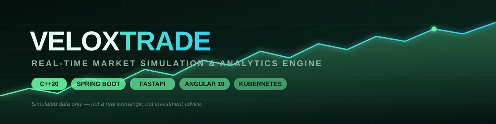
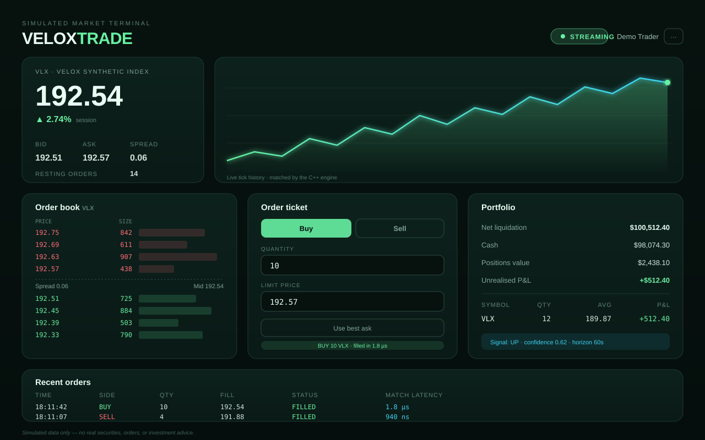
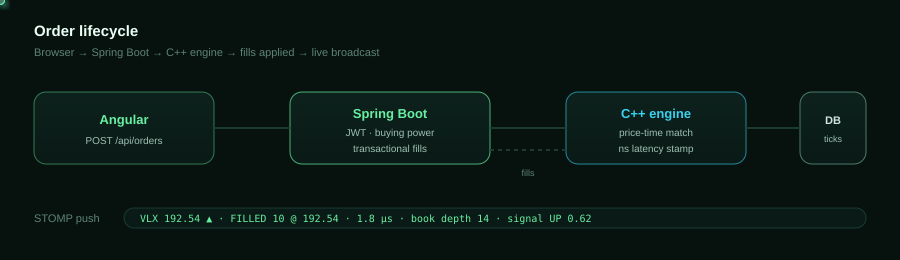
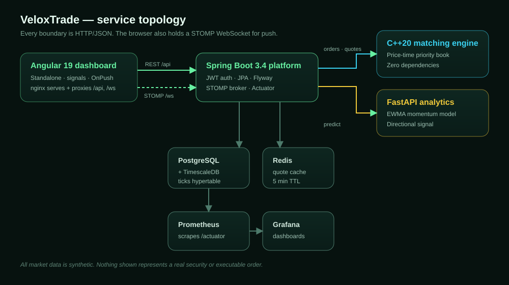
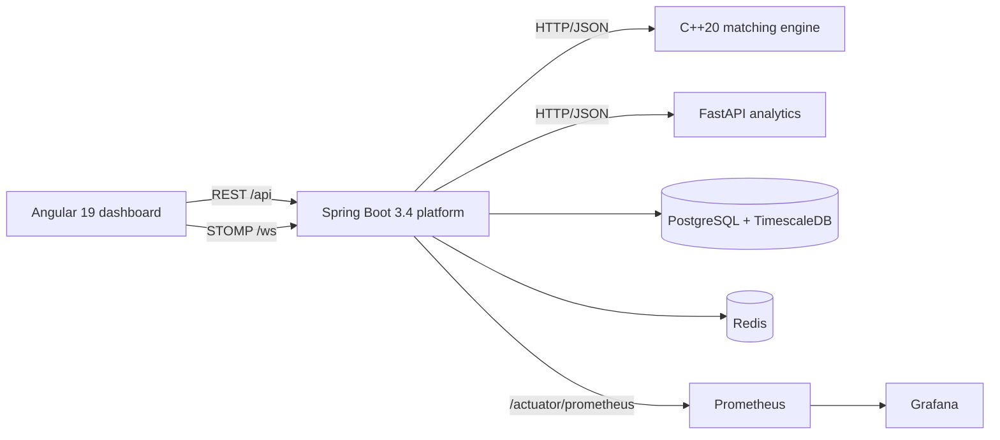
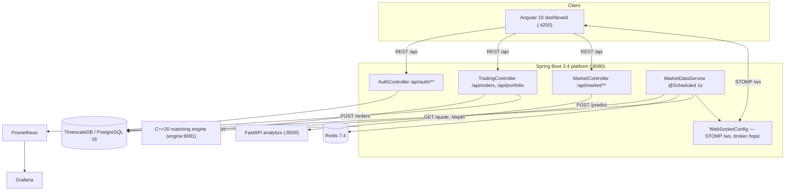

<div align="center">



<h1>VeloxTrade</h1>

<p><b>A real-time market simulation & analytics engine.</b><br>
Low-latency C++ matching · enterprise Java APIs · Python analytics · a live Angular trading terminal.</p>

<p>
  
  
  
  
  
  
</p>
<p>
  
  
  
  
  
  
  
</p>

</div>


---

## The dashboard

<div align="center">
  
</div>

A dark trading terminal built with Angular 19 standalone components and signals: a live price chart, a depth ladder with proportional liquidity bars, an order ticket, portfolio marks, an analytics signal card, and a fill blotter showing **nanosecond match latency** for every order.

---

## How an order travels

<div align="center">
  
</div>

1. You submit a limit order from the browser with a **JWT bearer token**.
2. Spring Boot authenticates you, checks **buying power**, and blocks short selling.
3. The **C++ engine** matches against its in-memory book using integer tick prices and stamps a nanosecond latency.
4. Fills are applied to cash and positions in **one transaction**, then persisted.
5. A scheduler polls the engine every second, caches the quote in Redis, and **pushes to every browser** over STOMP.

---

## Quick start

```bash
git clone https://github.com/haarikaalla/VeloxTrade-.git
cd VeloxTrade-
docker compose up --build
```

Open **<http://localhost:4200>**, register an account, receive $100,000 of simulated cash, and start trading `VLX`.

| Service | Address | What it does |
| :--- | :--- | :--- |
| 📈 **Dashboard** | <http://localhost:4200> | Trading terminal |
| ⚙️ **Platform API** | <http://localhost:8080> | REST · WebSocket · Actuator |
| 📘 **Swagger UI** | <http://localhost:8080/swagger-ui.html> | Interactive API docs |
| 🧠 **Analytics** | <http://localhost:8000/docs> | Directional signal model |
| ⚡ **Engine** | internal `engine:8081` | Order book & fills |
| 🔥 **Prometheus** | <http://localhost:9090> | Metrics |
| 📊 **Grafana** | <http://localhost:3000> | Dashboards |

> [!TIP]
> **No Docker or JDK installed?** Preview the UI alone with a dependency-free stub backend:
> ```bash
> python tools/mock-platform.py          # terminal 1
> cd dashboard-angular && npm install && npm start   # terminal 2
> ```

---

## Architecture

<div align="center">
  
</div>



<details>
<summary><b>Why HTTP/JSON instead of gRPC?</b></summary>

<br>

The matching engine is deliberately free of third-party dependencies — it ships its own HTTP/1.1 server over BSD sockets/Winsock and hand-written JSON serialisation. That keeps the engine image tiny, makes the build reproducible on any C++20 toolchain, and removes the codegen step entirely. The whole repo builds with nothing but CMake, Maven, pip, and npm.

</details>

---

## Engineering highlights

| | |
| :--- | :--- |
| ⚡ **Zero-dependency engine** | Order book, HTTP server, and JSON emitter all hand-written in C++20 |
| 🎯 **Exact price math** | Prices held as **integer ticks**, so matching never suffers float drift |
| ⏱️ **Latency telemetry** | Every fill carries a nanosecond match time, aggregated to p50/p95/p99 in Micrometer |
| 🔐 **Real auth** | HS256 JWT, BCrypt(12), and a **decoy-hash login** so unknown users and wrong passwords take identical time |
| 🧾 **Correct accounting** | Weighted-average cost basis, optimistic locking, buying-power checks, short-selling blocked |
| 📡 **Live push** | STOMP over WebSocket with automatic REST-polling fallback when the socket drops |
| 🗄️ **Time-series ready** | Flyway migration conditionally enables a TimescaleDB hypertable, degrading gracefully on plain Postgres |
| 🚢 **Production posture** | Non-root containers, dropped capabilities, read-only root filesystems, health/readiness/startup probes |

---

## Repository map

```
VeloxTrade/
├── engine-cpp/          ⚡ C++20 order book, HTTP server, CTest suite
├── platform-java/       ⚙️ Spring Boot API, JPA, Flyway, JWT security
├── ml-python/           🧠 FastAPI analytics + pytest suite
├── dashboard-angular/   📈 Angular 19 terminal + Karma specs
├── infra/               🚢 Prometheus, Grafana, Helm chart
├── tools/               🔧 Dependency-free mock API for UI-only demos
└── .github/workflows/   ✅ 5-job CI pipeline
```

---

## API surface

<details open>
<summary><b>Public endpoints</b></summary>

<br>

| Method | Path | Description |
| :--- | :--- | :--- |
| `POST` | `/api/auth/register` | Create an account with opening cash |
| `POST` | `/api/auth/login` | Exchange credentials for a JWT |
| `GET` | `/api/market/quote` | Latest simulated quote |
| `GET` | `/api/market/depth` | Aggregated bid/ask ladder |
| `GET` | `/api/market/history?limit=90` | Recent tick series (oldest first) |
| `GET` | `/api/market/signal` | Analytics directional signal |
| `WS` | `/ws` | STOMP; topics `/topic/market/VLX`, `/topic/depth/VLX` |

</details>

<details>
<summary><b>Authenticated endpoints</b> — <code>Authorization: Bearer &lt;token&gt;</code></summary>

<br>

| Method | Path | Description |
| :--- | :--- | :--- |
| `POST` | `/api/orders` | Submit a limit order |
| `GET` | `/api/orders?limit=20` | Recent order history |
| `GET` | `/api/portfolio` | Positions, unrealised P&L, net liquidation |

```jsonc
// POST /api/orders
{ "symbol": "VLX", "side": "BUY", "quantity": 10, "limitPrice": 187.42 }
```

```jsonc
// 201 Created
{
  "orderId": "9f2c…", "status": "FILLED", "filledQuantity": 10,
  "averageFillPrice": 187.42, "matchLatencyNanos": 1834
}
```

Errors use one envelope — `{ timestamp, status, error, details }` — with `400` for validation, `422` for trading-rule violations, and `503` when an upstream service is down.

</details>

---

## Local development

**Prerequisites:** CMake 3.20+ · JDK 21 · Node 22 · Python 3.13 · Docker Desktop

<details>
<summary><b>⚡ C++ engine</b></summary>

```bash
cmake -S engine-cpp -B build/engine -DCMAKE_BUILD_TYPE=Release
cmake --build build/engine --parallel
ctest --test-dir build/engine --output-on-failure
./build/engine/veloxtrade-engine        # ENGINE_PORT, default 8081
```
</details>

<details>
<summary><b>⚙️ Spring Boot platform</b></summary>

```bash
cd platform-java
mvn test                 # H2-backed integration tests
docker compose up postgres redis
mvn spring-boot:run
```
</details>

<details>
<summary><b> FastAPI analytics</b></summary>

```bash
cd ml-python
python -m venv .venv && .venv/Scripts/activate    # source .venv/bin/activate on Unix
pip install -r requirements-dev.txt
pytest
uvicorn app.main:app --reload
```
</details>

<details>
<summary><b>📈 Angular dashboard</b></summary>

```bash
cd dashboard-angular
npm install
npm start        # proxies /api and /ws to localhost:8080
npm test
npm run build
```
</details>

---

## Security model

- Stateless **HS256 JWT** bearer tokens — no server-side session state.
- Passwords hashed with **BCrypt (strength 12)**.
- Login compares against a **decoy hash** for unknown emails, so user enumeration is not possible via timing.
- A missing or short `VELOXTRADE_JWT_SECRET` produces a logged warning and an **ephemeral random key** — never a hard-coded fallback.
- CORS origins, database credentials, and secrets are entirely environment-driven.
- Containers run as **non-root (uid 10001)** with dropped capabilities and read-only root filesystems in Kubernetes.
- Error responses never leak stack traces or internal messages.

---

## Deployment

```bash
helm install veloxtrade infra/helm/veloxtrade \
  --set imageRegistry=ghcr.io/your-org \
  --set platform.jwtSecret="$(openssl rand -base64 48)" \
  --set platform.datasourcePassword="$(openssl rand -base64 24)"
```

The chart deploys all four services with probes, resource limits, and security contexts. It **fails the install** if `platform.jwtSecret` is absent, or you can supply `platform.existingDatabaseSecret` instead.

---

## Testing

| Job | Coverage |
| :--- | :--- |
| `engine` | CMake build + `ctest` — matching, partial fills, time priority, cancels, validation |
| `platform` | `mvn test package` — cost-basis math, auth flows, buying power, short-sell blocks, error envelopes |
| `analytics` | `pytest` — model behaviour and API contract |
| `dashboard` | `ng test` in headless Chrome + production build |
| `compose` | `docker compose config` validation |

---

## High-level design (HLD)

VeloxTrade is four independently deployable services connected over HTTP/JSON and WebSocket/STOMP, backed by TimescaleDB (PostgreSQL 16) and Redis, and observed via Prometheus/Grafana.



**Responsibilities per service**

| Service | Responsibility | Talks to |
| :--- | :--- | :--- |
| **Dashboard (Angular 19)** | Price chart, depth ladder, order ticket, portfolio, blotter; JWT session in `sessionStorage`; live STOMP stream with a REST-polling safety net | Platform REST + STOMP |
| **Platform (Spring Boot 3.4)** | AuthN/AuthZ, order validation and trading rules, persistence, portfolio accounting, engine polling + Redis caching + tick history, WebSocket fan-out, Micrometer metrics | Engine, Analytics, PostgreSQL, Redis, Prometheus |
| **Engine (C++20)** | In-memory price-time-priority book, matching, nanosecond latency stamping, and a **simulated price random walk** that seeds liquidity | Serves its own HTTP/1.1 API to the Platform |
| **Analytics (FastAPI)** | EWMA momentum + realised-volatility directional signal over recent returns | Called by `MarketController` via `AnalyticsClient` |
| **TimescaleDB** | `accounts`, `positions`, `orders`, and `market_ticks` (hypertable when the extension is available) | Platform only |
| **Redis 7.4** | 5-minute TTL cache of the latest quote snapshot | Platform only |
| **Prometheus / Grafana** | Scrapes `/actuator/prometheus`; dashboards provisioned from `infra/grafana` | Platform |

**Key architectural decisions**

- **Service boundary = HTTP/JSON**, deliberately avoiding gRPC/codegen so the engine stays dependency-free (see [Architecture](#architecture)).
- **Synchronous request/response** between Platform and Engine for order submission, so match latency is measured and stored per order.
- **Push + poll hybrid**: `MarketDataService` polls the engine every second and fans out over STOMP; the dashboard additionally polls REST every 2s (quote/depth) and 10s (portfolio/orders) as a safety net.
- **Stateless auth**: HS256 JWTs (12h TTL) mean Platform instances scale horizontally with no shared session store.

---

## Low-level design (LLD)

### Matching engine (`engine-cpp`)

**HTTP surface** (hand-rolled HTTP/1.1 server, no third-party libraries):

| Method | Path | Response |
| :--- | :--- | :--- |
| `GET` | `/health` | `{"status":"UP","service":"veloxtrade-engine"}` |
| `GET` | `/quote` | `{symbol, price, bid, ask, restingOrders, timestamp}` |
| `GET` | `/depth` | `{symbol, bids[], asks[], timestamp}` — top 8 levels per side |
| `POST` | `/orders` | `{orderId, status, filledQuantity, restingQuantity, matchLatencyNanos, fills[], executedAt}` |

Wrong method → `405`; unknown path → `404`. Port comes from `ENGINE_PORT` (default `8081`), bound on `0.0.0.0`.

- **`OrderBook`** ([order_book.hpp](engine-cpp/include/velox/order_book.hpp)) keeps two price-time-priority ladders:
  - `BidLadder = std::map<int64_t, std::deque<Order>, std::greater<>>` (descending)
  - `AskLadder = std::map<int64_t, std::deque<Order>, std::less<>>` (ascending)
  - Prices are `int64_t` **integer ticks (cents)**, so matching never suffers float drift.
- `submit(side, price_ticks, quantity)` walks the opposing ladder best-price-first, fills FIFO within each level (time priority via a monotonic `sequence`), and returns a `MatchResult` with every `Fill` plus any resting remainder. `cancel(order_id)` scans both ladders and erases the price level when its deque empties. `depth(levels)` aggregates quantity per level.
- **`EngineService`** owns a `std::mutex` guarding the book; `quote_json()`, `depth_json()`, `submit_json()` and `drift()` all take a `std::lock_guard`. Match latency is measured inside `submit_json()` with `std::chrono::steady_clock` and reported as `matchLatencyNanos`.
- **Market simulation:** a detached thread calls `drift()` every 500 ms, applying a `std::normal_distribution(0.0, 18.0)` shock in ticks, clamping the price to `[1000, 10000000]`, and reseeding 6 levels of random liquidity per side whenever the book thins out.
- **`HttpServer`** uses a blocking accept loop (backlog 64) and spawns a **detached thread per connection**; the service mutex keeps the book consistent across those threads.

### Platform (`platform-java`)

**Layering:** `web` (controllers) → `service` (rules) → `repository` (Spring Data JPA) → PostgreSQL, with `security` for JWT and `config` for HTTP clients, properties, and WebSocket wiring.

| Class | Layer | Purpose |
| :--- | :--- | :--- |
| `AuthController` | web | `POST /api/auth/register` (201), `POST /api/auth/login` → `AuthResponse` |
| `TradingController` | web | `POST /api/orders` (201), `GET /api/orders?limit=20`, `GET /api/portfolio` — all authenticated |
| `MarketController` | web | `GET /api/market/quote`, `/depth`, `/history?limit=60` (clamped 1–500), `/signal` — public |
| `ApiExceptionHandler` | web | One `ApiError` envelope: validation → 400, `TradingRuleException` → 422, `UpstreamUnavailableException` → 503 |
| `AccountService` | service | Registration with `openingCash` (100,000); login compares against a BCrypt **decoy hash** of a random UUID when the email is unknown, so timing is identical |
| `TradingService` | service | `placeOrder` (`@Transactional`) and `recentOrders` (`@Transactional(readOnly = true)`) |
| `PortfolioService` | service | Per-position `marketValue`, `costBasis`, `unrealizedPnl`; aggregates `positionsValue` and `netLiquidation = cash + positionsValue` |
| `MarketDataService` | service | `@Scheduled(fixedRateString = "${veloxtrade.tick-interval}")` — 1s engine poll, Redis cache, tick persistence, STOMP broadcast |
| `EngineClient` | service | `RestClient` (`@Qualifier("engineRestClient")`) → engine `GET /quote`, `GET /depth`, `POST /orders` |
| `AnalyticsClient` | service | `RestClient` (`analyticsRestClient`) → analytics `POST /predict` with `{symbol, lastPrice, recentReturns}` |
| `JwtService` | security | Issues/verifies HS256 tokens (subject = account UUID, `email` claim, 12h TTL); a secret shorter than 32 bytes triggers a warning and an **ephemeral key** |
| `JwtAuthenticationFilter` | security | `OncePerRequestFilter`; parses `Authorization: Bearer`, sets an `AuthenticatedAccount` principal with `ROLE_TRADER` |
| `SecurityConfig` | security | CSRF off, CORS from config, `SessionCreationPolicy.STATELESS`; permits auth, `GET /api/market/**`, `/ws/**`, health/prometheus, Swagger; everything else authenticated; 401 on failure |
| `HttpClientConfig` | config | Builds the two `RestClient` beans with per-target connect/read timeouts (engine 2s, analytics 3s) |
| `PlatformProperties` | config | `@ConfigurationProperties("veloxtrade")` record: `symbol`, `openingCash`, `tickInterval`, `allowedOrigins`, `engine`, `analytics`, `security` |
| `WebSocketConfig` | config | STOMP endpoint `/ws`, simple broker on `/topic`, app prefix `/app`, origins from `allowedOrigins` |

**Order flow inside `TradingService.placeOrder`:**

1. Reject if the symbol ≠ `properties.symbol()` (`VLX`) or the account is missing → `TradingRuleException` → 422.
2. **BUY:** reject when `cashBalance < limitPrice × quantity` (buying-power check). **SELL:** reject when the held `Position.quantity < request.quantity` — short selling is blocked.
3. Call `EngineClient.submitOrder`; upstream failures surface as `UpstreamUnavailableException` → 503.
4. For each returned fill, accumulate cash moved and call `Position.apply(side, qty, price)` (weighted-average cost basis); then `account.debit(...)` on BUY or `account.credit(...)` on SELL.
5. Persist `Position`, `Account`, and a `TradeOrder` row inside the same transaction.

**Market data loop (`MarketDataService.pollEngine`, every 1s):** `GET /quote` + `GET /depth` from the engine → cache the quote in Redis under `veloxtrade:quote:{symbol}` with a 5-minute TTL (`StringRedisTemplate` is optional and injected via `ObjectProvider`, so the app runs without Redis) → persist a `MarketTick` → `convertAndSend` to `/topic/market/{symbol}` and `/topic/depth/{symbol}`.

**Domain model → schema** (see [V1__baseline.sql](platform-java/src/main/resources/db/migration/V1__baseline.sql)):

- `Account` → `accounts` (uuid pk, unique `email`, BCrypt(12) `password_hash`, `cash_balance numeric(19,2)`, `created_at`).
- `Position` → `positions`, unique on `(account_id, symbol)`, with an **`@Version` optimistic-locking** column guarding concurrent fills.
- `TradeOrder` → `orders`, storing `side`/`status` enums as strings plus `filled_quantity`, `average_fill_price`, `engine_order_id`, and `match_latency_nanos`.
- `MarketTick` → `market_ticks`, keyed on `(id, observed_at)` so it can be promoted to a TimescaleDB hypertable, falling back to a plain indexed table when the extension is absent.

**Repositories:** `AccountRepository` (`findByEmailIgnoreCase`, `existsByEmailIgnoreCase`), `PositionRepository` (`findByAccountId`, `findByAccountIdAndSymbol`), `TradeOrderRepository` (`findByAccountIdOrderByCreatedAtDesc`), `MarketTickRepository` (`findBySymbolOrderByObservedAtDesc`) — all `JpaRepository` with `Limit` parameters.

### Analytics (`ml-python`)

- `app/main.py` exposes `GET /health` and `POST /predict`. `PredictionRequest` = `{symbol, lastPrice, recentReturns[]}` (window capped at `MAX_WINDOW = 120`); `PredictionResponse` = `{symbol, direction, confidence, momentum, volatility, horizonSeconds, disclaimer}`.
- `app/model.py` is pure-function: `_ewma(values, half_life=8.0)` for momentum, `_volatility(values)` for realised (sample) standard deviation, then `scaled = momentum / (volatility + 1e-6)` and `P(up) = sigmoid(4.0 × scaled)`. Direction is `UP`/`DOWN` around 0.5 and `FLAT` with no data; confidence is clipped to `[0, 0.85]`. Results are returned as a frozen `Signal` dataclass with `DEFAULT_HORIZON_SECONDS = 60` and a fixed simulation `DISCLAIMER`.
- `tests/test_model.py` asserts the algorithm directly; `tests/test_api.py` covers the HTTP contract.

### Dashboard (`dashboard-angular`)

- **Components** (`components/`): `price-chart` (hand-drawn SVG area chart — no charting library), `order-book` (depth ladder with proportional liquidity bars), `auth-panel` (login/register toggle) — all standalone, `OnPush`, signal-driven.
- **Core services** (`core/`):
  - `auth.service.ts` — `register`/`login`/`logout`, session held in a `signal` and mirrored to `sessionStorage` under `veloxtrade.session`; exposes `isAuthenticated` and `displayName` computeds and expires the token on TTL.
  - `auth.interceptor.ts` — `HttpInterceptorFn` that attaches `Authorization: Bearer` to `/api/` calls except `/api/auth/*`, and logs out on `401`.
  - `market-api.service.ts` — typed calls: `quote`, `depth`, `history(limit=90)`, `signal`, `placeOrder`, `orders(limit=15)`, `portfolio` (DTO types in `models.ts` mirror the Java records).
  - `market-stream.service.ts` — `@stomp/stompjs` `Client` over `ws(s)://…/ws`, subscribing to `/topic/market/{symbol}` and `/topic/depth/{symbol}`, exposing `quote`, `depth`, and `connected` signals with a 4s reconnect delay and 10s heartbeats.
- `app.component.ts` owns the **REST fallback**: `interval(2000)` refreshes quote/depth whenever the socket is down, and `interval(10_000)` refreshes portfolio and orders.
- `app.config.ts` provides `provideZoneChangeDetection({ eventCoalescing: true })` and `provideHttpClient(withInterceptors([authInterceptor]))`; `proxy.conf.json` forwards `/api` and `/ws` (with `ws: true`) to `localhost:8080` in dev, and nginx does the same in production.

---


