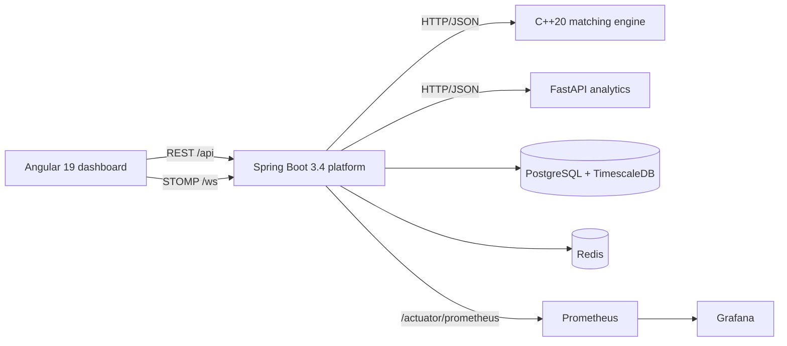
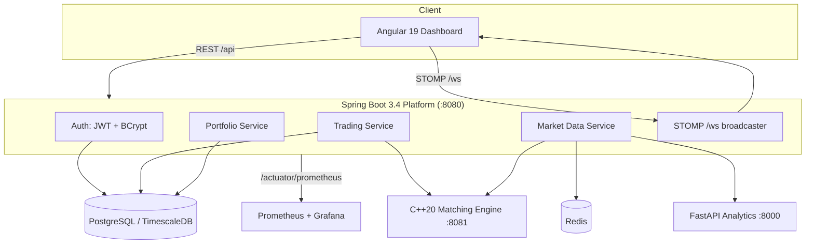

<div align="center">


<h1>VeloxTrade</h1>

<p><b>A real-time market simulation & analytics engine.</b><br>
Low-latency C++ matching · enterprise Java APIs · Python analytics · a live Angular trading terminal.</p>

<p>
  
  
  
  
  
  
</p>
<p>
  
  
  
  
  
  
  
</p>

</div>


---

## The dashboard

<div align="center">
  
</div>

A dark trading terminal built with Angular 19 standalone components and signals: a live price chart, a depth ladder with proportional liquidity bars, an order ticket, portfolio marks, an analytics signal card, and a fill blotter showing **nanosecond match latency** for every order.

---

## How an order travels

<div align="center">
  
</div>

1. You submit a limit order from the browser with a **JWT bearer token**.
2. Spring Boot authenticates you, checks **buying power**, and blocks short selling.
3. The **C++ engine** matches against its in-memory book using integer tick prices and stamps a nanosecond latency.
4. Fills are applied to cash and positions in **one transaction**, then persisted.
5. A scheduler polls the engine every second, caches the quote in Redis, and **pushes to every browser** over STOMP.

---

## Quick start

```bash
git clone https://github.com/haarikaalla/VeloxTrade-.git
cd VeloxTrade-
docker compose up --build
```

Open **<http://localhost:4200>**, register an account, receive $100,000 of simulated cash, and start trading `VLX`.

| Service | Address | What it does |
| :--- | :--- | :--- |
| 📈 **Dashboard** | <http://localhost:4200> | Trading terminal |
| ⚙️ **Platform API** | <http://localhost:8080> | REST · WebSocket · Actuator |
| 📘 **Swagger UI** | <http://localhost:8080/swagger-ui.html> | Interactive API docs |
| 🧠 **Analytics** | <http://localhost:8000/docs> | Directional signal model |
| ⚡ **Engine** | internal `engine:8081` | Order book & fills |
| 🔥 **Prometheus** | <http://localhost:9090> | Metrics |
| 📊 **Grafana** | <http://localhost:3000> | Dashboards |

> [!TIP]
> **No Docker or JDK installed?** Preview the UI alone with a dependency-free stub backend:
> ```bash
> python tools/mock-platform.py          # terminal 1
> cd dashboard-angular && npm install && npm start   # terminal 2
> ```

---

## Architecture

<div align="center">
  
</div>



<details>
<summary><b>Why HTTP/JSON instead of gRPC?</b></summary>

<br>

The matching engine is deliberately free of third-party dependencies — it ships its own HTTP/1.1 server over BSD sockets/Winsock and hand-written JSON serialisation. That keeps the engine image tiny, makes the build reproducible on any C++20 toolchain, and removes the codegen step entirely. The whole repo builds with nothing but CMake, Maven, pip, and npm.

</details>

---

## Engineering highlights

| | |
| :--- | :--- |
| ⚡ **Zero-dependency engine** | Order book, HTTP server, and JSON emitter all hand-written in C++20 |
| 🎯 **Exact price math** | Prices held as **integer ticks**, so matching never suffers float drift |
| ⏱️ **Latency telemetry** | Every fill carries a nanosecond match time, aggregated to p50/p95/p99 in Micrometer |
| 🔐 **Real auth** | HS256 JWT, BCrypt(12), and a **decoy-hash login** so unknown users and wrong passwords take identical time |
| 🧾 **Correct accounting** | Weighted-average cost basis, optimistic locking, buying-power checks, short-selling blocked |
| 📡 **Live push** | STOMP over WebSocket with automatic REST-polling fallback when the socket drops |
| 🗄️ **Time-series ready** | Flyway migration conditionally enables a TimescaleDB hypertable, degrading gracefully on plain Postgres |
| 🚢 **Production posture** | Non-root containers, dropped capabilities, read-only root filesystems, health/readiness/startup probes |

---

## Repository map

```
VeloxTrade/
├── engine-cpp/          ⚡ C++20 order book, HTTP server, CTest suite
├── platform-java/       ⚙️ Spring Boot API, JPA, Flyway, JWT security
├── ml-python/           🧠 FastAPI analytics + pytest suite
├── dashboard-angular/   📈 Angular 19 terminal + Karma specs
├── infra/               🚢 Prometheus, Grafana, Helm chart
├── tools/               🔧 Dependency-free mock API for UI-only demos
└── .github/workflows/   ✅ 5-job CI pipeline
```

---

## API surface

<details open>
<summary><b>Public endpoints</b></summary>

<br>

| Method | Path | Description |
| :--- | :--- | :--- |
| `POST` | `/api/auth/register` | Create an account with opening cash |
| `POST` | `/api/auth/login` | Exchange credentials for a JWT |
| `GET` | `/api/market/quote` | Latest simulated quote |
| `GET` | `/api/market/depth` | Aggregated bid/ask ladder |
| `GET` | `/api/market/history?limit=90` | Recent tick series (oldest first) |
| `GET` | `/api/market/signal` | Analytics directional signal |
| `WS` | `/ws` | STOMP; topics `/topic/market/VLX`, `/topic/depth/VLX` |

</details>

<details>
<summary><b>Authenticated endpoints</b> — <code>Authorization: Bearer &lt;token&gt;</code></summary>

<br>

| Method | Path | Description |
| :--- | :--- | :--- |
| `POST` | `/api/orders` | Submit a limit order |
| `GET` | `/api/orders?limit=20` | Recent order history |
| `GET` | `/api/portfolio` | Positions, unrealised P&L, net liquidation |

```jsonc
// POST /api/orders
{ "symbol": "VLX", "side": "BUY", "quantity": 10, "limitPrice": 187.42 }
```

```jsonc
// 201 Created
{
  "orderId": "9f2c…", "status": "FILLED", "filledQuantity": 10,
  "averageFillPrice": 187.42, "matchLatencyNanos": 1834
}
```

Errors use one envelope — `{ timestamp, status, error, details }` — with `400` for validation, `422` for trading-rule violations, and `503` when an upstream service is down.

</details>

---

## Local development

**Prerequisites:** CMake 3.20+ · JDK 21 · Node 22 · Python 3.13 · Docker Desktop

<details>
<summary><b>⚡ C++ engine</b></summary>

```bash
cmake -S engine-cpp -B build/engine -DCMAKE_BUILD_TYPE=Release
cmake --build build/engine --parallel
ctest --test-dir build/engine --output-on-failure
./build/engine/veloxtrade-engine        # ENGINE_PORT, default 8081
```
</details>

<details>
<summary><b>⚙️ Spring Boot platform</b></summary>

```bash
cd platform-java
mvn test                 # H2-backed integration tests
docker compose up postgres redis
mvn spring-boot:run
```
</details>

<details>
<summary><b> FastAPI analytics</b></summary>

```bash
cd ml-python
python -m venv .venv && .venv/Scripts/activate    # source .venv/bin/activate on Unix
pip install -r requirements-dev.txt
pytest
uvicorn app.main:app --reload
```
</details>

<details>
<summary><b>📈 Angular dashboard</b></summary>

```bash
cd dashboard-angular
npm install
npm start        # proxies /api and /ws to localhost:8080
npm test
npm run build
```
</details>

---

## Security model

- Stateless **HS256 JWT** bearer tokens — no server-side session state.
- Passwords hashed with **BCrypt (strength 12)**.
- Login compares against a **decoy hash** for unknown emails, so user enumeration is not possible via timing.
- A missing or short `VELOXTRADE_JWT_SECRET` produces a logged warning and an **ephemeral random key** — never a hard-coded fallback.
- CORS origins, database credentials, and secrets are entirely environment-driven.
- Containers run as **non-root (uid 10001)** with dropped capabilities and read-only root filesystems in Kubernetes.
- Error responses never leak stack traces or internal messages.

---

## Deployment

```bash
helm install veloxtrade infra/helm/veloxtrade \
  --set imageRegistry=ghcr.io/your-org \
  --set platform.jwtSecret="$(openssl rand -base64 48)" \
  --set platform.datasourcePassword="$(openssl rand -base64 24)"
```

The chart deploys all four services with probes, resource limits, and security contexts. It **fails the install** if `platform.jwtSecret` is absent, or you can supply `platform.existingDatabaseSecret` instead.

---

## Testing

| Job | Coverage |
| :--- | :--- |
| `engine` | CMake build + `ctest` — matching, partial fills, time priority, cancels, validation |
| `platform` | `mvn test package` — cost-basis math, auth flows, buying power, short-sell blocks, error envelopes |
| `analytics` | `pytest` — model behaviour and API contract |
| `dashboard` | `ng test` in headless Chrome + production build |
| `compose` | `docker compose config` validation |

---

## High-level design (HLD)

VeloxTrade is four independently deployable services connected over HTTP/JSON and WebSocket/STOMP, backed by PostgreSQL/TimescaleDB and Redis, and observed via Prometheus/Grafana.



**Responsibilities per service**

| Service | Responsibility | Talks to |
| :--- | :--- | :--- |
| **Dashboard (Angular)** | Renders price chart, depth ladder, order ticket, portfolio, blotter; authenticates and streams live updates | Platform REST + STOMP |
| **Platform (Spring Boot)** | AuthN/AuthZ, order validation & buying-power/short-sell rules, persistence, portfolio accounting, market-data polling/caching, WebSocket fan-out, metrics | Engine, Analytics, PostgreSQL, Redis, Prometheus |
| **Engine (C++20)** | In-memory price-time-priority order book, matching, nanosecond latency stamping | Called synchronously by Platform over its own HTTP server |
| **Analytics (FastAPI)** | Computes a directional signal from recent tick history | Called by Platform's `MarketDataService` |
| **PostgreSQL/TimescaleDB** | Durable store for accounts, positions, orders, and tick history (hypertable when available) | Platform only |
| **Redis** | Short-lived cache for the latest quote/depth snapshot | Platform only |
| **Prometheus/Grafana** | Scrapes `/actuator/prometheus`, visualises latency and system health | Platform |

**Key architectural decisions**

- **Service boundary = HTTP/JSON**, deliberately avoiding gRPC/codegen so the engine stays dependency-free and every service builds with a single, ordinary toolchain (see [Architecture](#architecture)).
- **Synchronous request/response** between Platform and Engine keeps order submission simple and lets match latency be measured end-to-end per order.
- **Push + poll hybrid** for live data: Platform polls the engine every second and pushes over STOMP, while the dashboard falls back to REST polling if the socket drops.
- **Stateless auth**: HS256 JWTs mean Platform instances can scale horizontally with no shared session store.

---

## Low-level design (LLD)

### Matching engine (`engine-cpp`)

- `OrderBook` (see [order_book.hpp](engine-cpp/include/velox/order_book.hpp)) holds two price-time-priority ladders:
  - `BidLadder = std::map<int64_t, std::deque<Order>, std::greater<>>`
  - `AskLadder = std::map<int64_t, std::deque<Order>, std::less<>>`
  - Prices are `int64_t` **integer ticks** (cents), avoiding floating-point drift during matching.
- `OrderBook::submit(side, price_ticks, quantity)` walks the opposing ladder while prices cross, filling FIFO within a price level (time priority via a monotonic `sequence` counter), and returns a `MatchResult` containing every `Fill` plus any resting remainder.
- `OrderBook::cancel(order_id)` removes a resting order by scanning its ladder; `depth(levels)` aggregates quantity per price level for the top N levels each side.
- `EngineService` / `http_server` (in `src/engine_service.cpp`, `src/http_server.cpp`) expose this book over a hand-rolled HTTP/1.1 server (BSD sockets/Winsock, no third-party libraries), serialising requests/responses as JSON.
- The book itself is **not thread-safe**; the HTTP layer serialises access, so there is a single logical matching thread per symbol.

### Platform (`platform-java`)

**Layering:** `web` (controllers) → `service` (business rules) → `repository` (Spring Data JPA) → PostgreSQL, with `security` handling JWT issuance/validation and `config` holding HTTP-client/WebSocket wiring.

| Class | Layer | Purpose |
| :--- | :--- | :--- |
| `AuthController` | web | `/api/auth/register`, `/api/auth/login` |
| `TradingController` | web | `/api/orders` (submit, list) |
| `MarketController` | web | `/api/market/*` quote, depth, history, signal |
| `ApiExceptionHandler` | web | Maps `TradingRuleException` → 422, validation → 400, `UpstreamUnavailableException` → 503, into one `ApiError` envelope |
| `AccountService` | service | Registration, credential checks with a decoy-hash comparison for unknown emails |
| `TradingService` | service | Validates buying power / short-sell rules, calls `EngineClient`, applies fills to `Account`/`Position` in one transaction, persists the `TradeOrder` |
| `PortfolioService` | service | Computes weighted-average cost basis, unrealised P&L, and net liquidation value |
| `MarketDataService` | service | Polls `EngineClient` every second, caches the quote/depth in Redis, calls `AnalyticsClient` for the signal, and pushes STOMP frames |
| `EngineClient` | service | HTTP client to the C++ engine (`HttpClientConfig` supplies the `RestClient`/timeouts) |
| `AnalyticsClient` | service | HTTP client to the FastAPI analytics service |

**Domain model → schema** (see [V1__baseline.sql](platform-java/src/main/resources/db/migration/V1__baseline.sql)):

- `Account` → `accounts` (uuid pk, unique `email`, BCrypt `password_hash`, `cash_balance numeric(19,2)`).
- `Position` → `positions`, unique on `(account_id, symbol)`, with an optimistic-locking `version` column.
- `TradeOrder` → `orders`, storing `side`/`status` enums as strings, `filled_quantity`, `average_fill_price`, the originating `engine_order_id`, and `match_latency_nanos`.
- `MarketTick` → `market_ticks`, keyed on `(id, observed_at)` so it can be promoted to a TimescaleDB hypertable (falls back to a plain indexed table when the extension is absent).

**Concurrency & correctness:** order fills, cash debits/credits, and position updates happen inside a single `@Transactional` boundary; `Position.version` provides optimistic locking against concurrent fills on the same symbol.

### Analytics (`ml-python`)

- `app/main.py` exposes the FastAPI routes consumed by `AnalyticsClient` (directional signal endpoint, OpenAPI docs at `/docs`).
- `app/model.py` implements the signal computation over the recent tick window supplied by Platform; pure-function style so `tests/test_model.py` can assert on behaviour without spinning up HTTP.
- `tests/test_api.py` covers the FastAPI contract (status codes, response shape).

### Dashboard (`dashboard-angular`)

- **Components** (`components/`): `price-chart`, `order-book` (depth ladder), `auth-panel` — all standalone, `OnPush`, signal-driven.
- **Core services** (`core/`):
  - `auth.service.ts` — login/register, JWT storage, exposes an auth signal.
  - `auth.interceptor.ts` — attaches the `Authorization: Bearer` header to outgoing requests.
  - `market-api.service.ts` — typed REST calls for quote/depth/history/orders/portfolio (see `models.ts` for DTOs).
  - `market-stream.service.ts` — opens the STOMP/WebSocket connection to `/ws`, subscribes to `/topic/market/VLX` and `/topic/depth/VLX`, and falls back to REST polling if the socket disconnects.
- `app.config.ts` wires the router, `HttpClient` with the auth interceptor, and app-wide providers; `proxy.conf.json` forwards `/api` and `/ws` to `localhost:8080` in dev.

---


